# Dokumentáció - soap-calculator-backend

## Lépések:

### SOAP típusú webszolgáltatás megismerése
Az első lépésem az volt, hogy utánnanéztem, hogy mi is ez a SOAP API és miben különbözik az általunk sokszor használt REST API-tól. Továbbá megnéztem még, hogy hogyan lehet leimplementálni Eclipse-ben.

### Eclipse IDE telepítése és haszálata
Ezután feltelepítettem az Eclipse-et. Kellett egy kis idő mire megszoktam az Eclipse-et az IntelliJ után. Például az Eclipse-ben az autocomplete teljesen máshogy működik, mint az IntelliJ-ben

### Dynamic Web Project elkezdése
A legtöbb időmet a projekt elindítása vette el. Többször kellett újra létre kellett hoznom a projektet, mivel különböző hibákat kaptam amikor web service-t szerettem volna készíteni.

Ezt a `NoClassFoundError` -t akkor kaptam amikor el akartam indítani a Tomcat szervert.
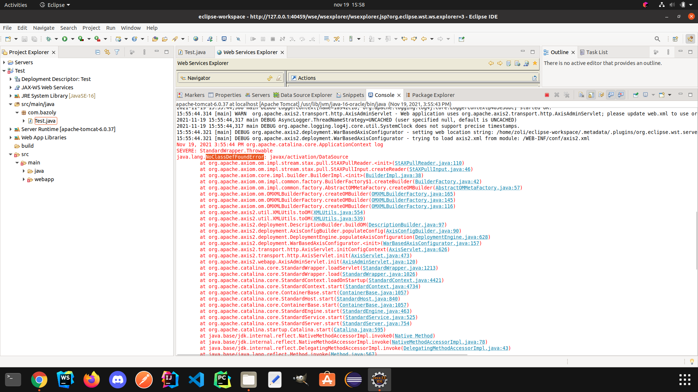

De volt olyan eset hogy ezt a hibaüzenetet kaptam az Eclipse-től: **IWAB0489E** Error when deploying Web service to Axis runtime.

#### Végül is ezekkel a beállításokkal sikerült megcsinálnom a projektet.
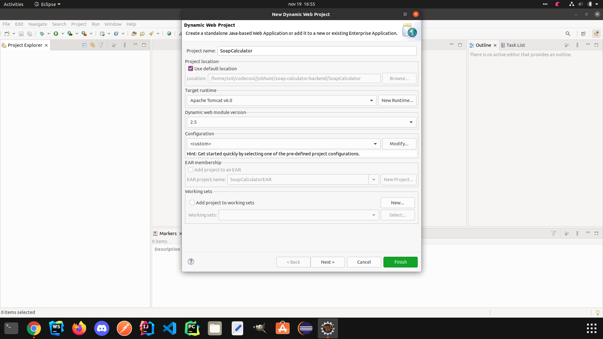

A Configuration résznél még hozzá kellett adnom az Axis2 Web Services-t.
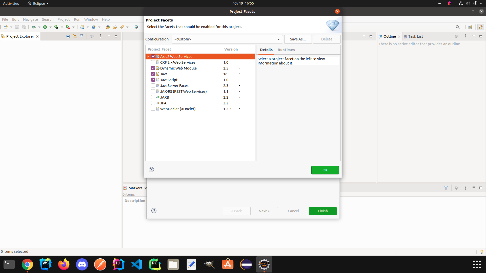

Az Axis2 Runtime helyét is meg kellett adnom a Preferences/Web Services menüpontban.
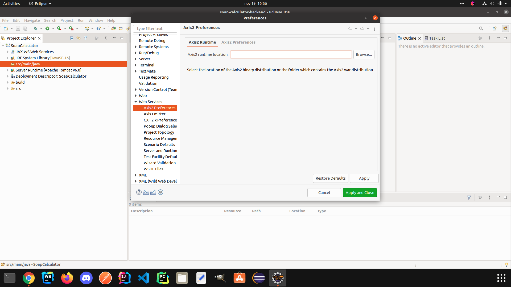

### Kalkulátor implementálása
Maga a kalkulátor implementálása gyorsan ment. A lenti képen látható az implementált kalkulátor metódusai és az éppen futó Tomcat webszerver.
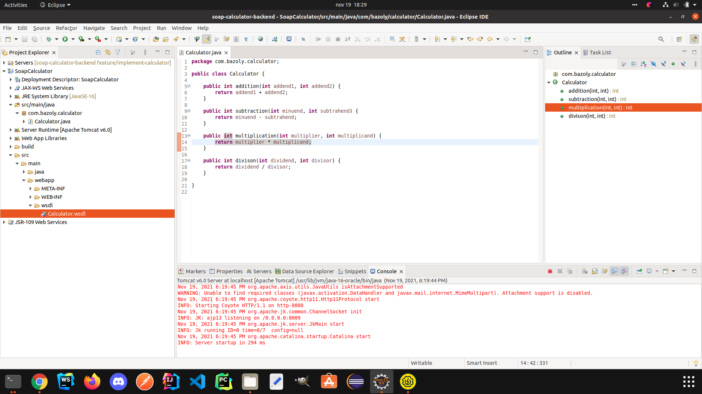

### Kalkulátor tesztelése SoapUI segítségéval
Valami okból kifolyólag a SoapUI alkalmazást nem tudtam elindítani a parancsikonjával. Amikor a parancsikonra kattintottam így nyitotta meg a filet egy text editor-ban.
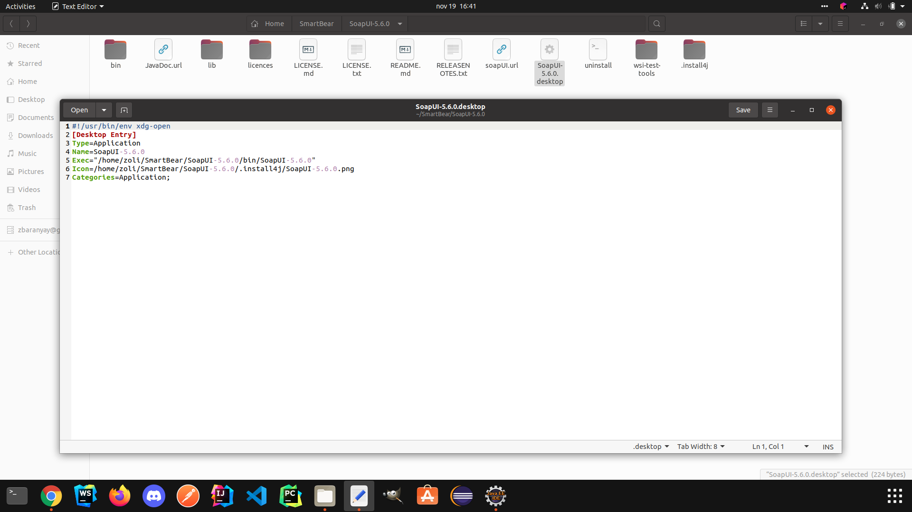

Úgyhogy megpróbáltam terminálból elindítani a shell script-ét és úgy már sikerült elindítanom a SoapUI.
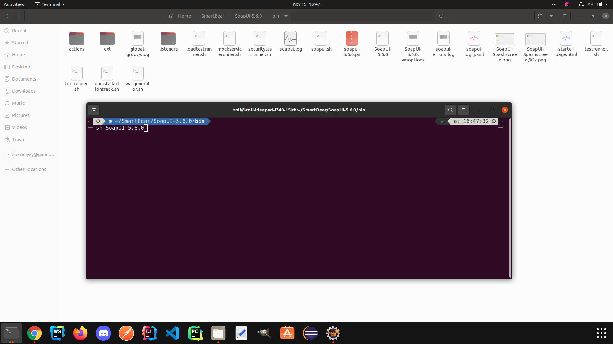
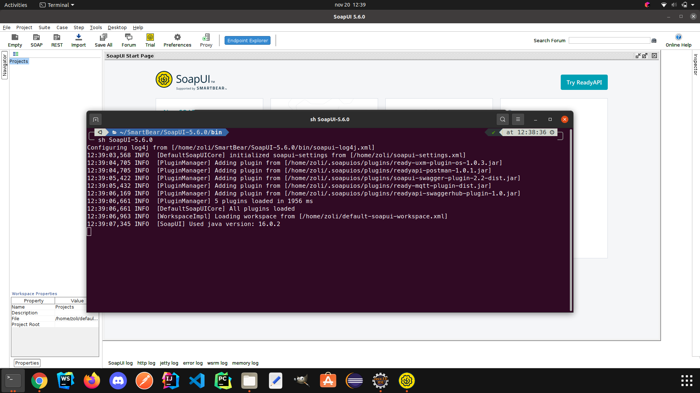

Először hozzáadtam a WSDL filet a projekthez.
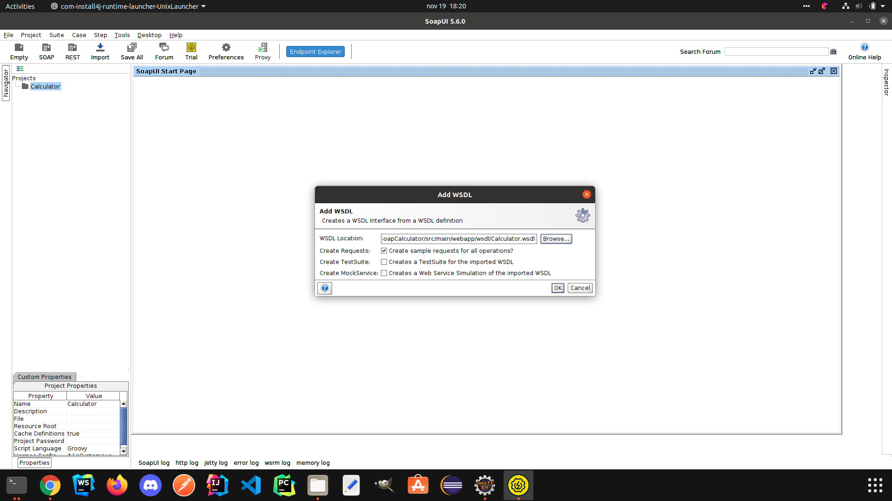

Majd végül leteszteltem a webszolgáltatásokat.
- Összeadás:
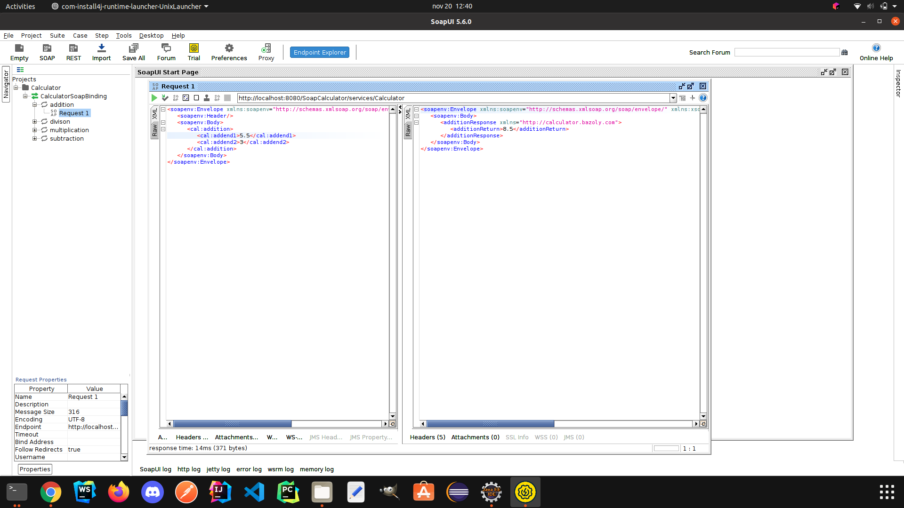

- Kivonás:
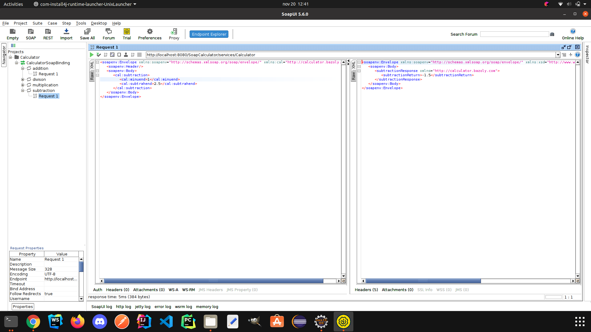

- Szorzás:
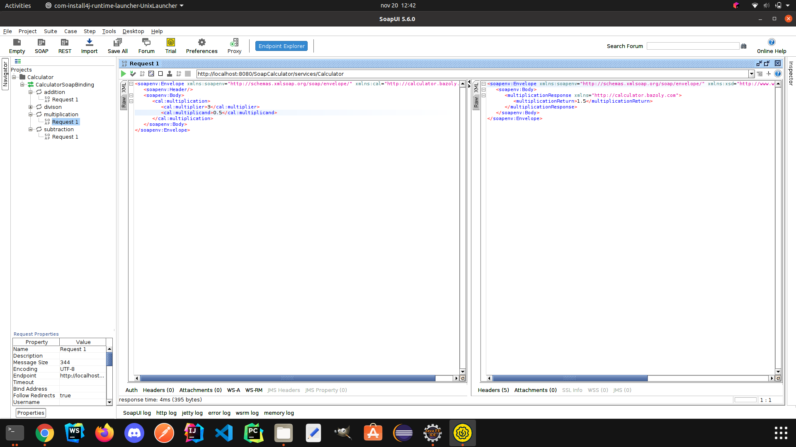

- Osztás:
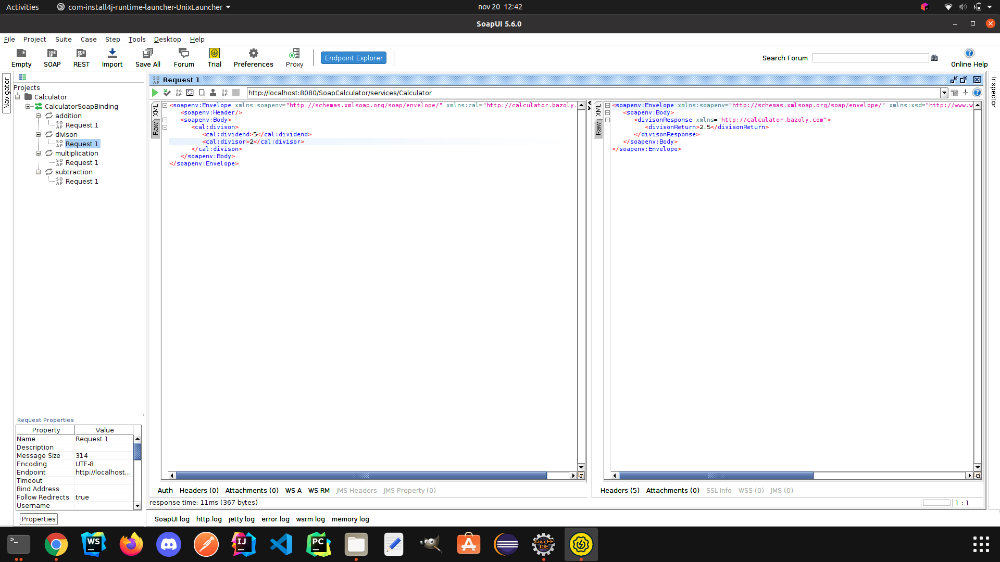
